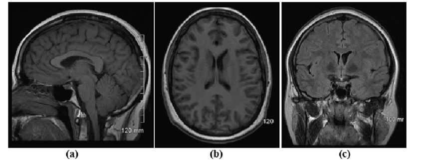
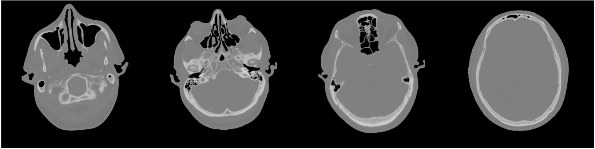
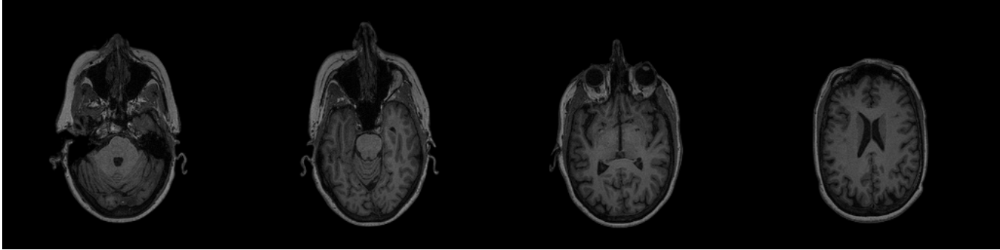
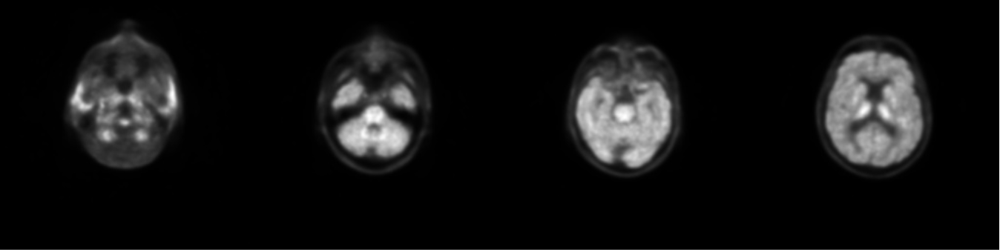
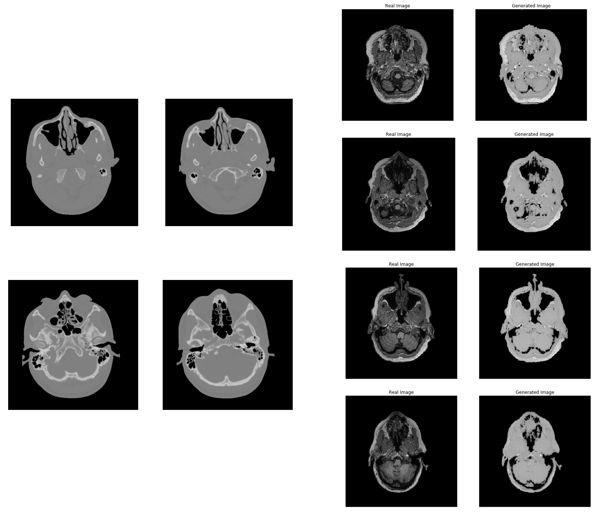
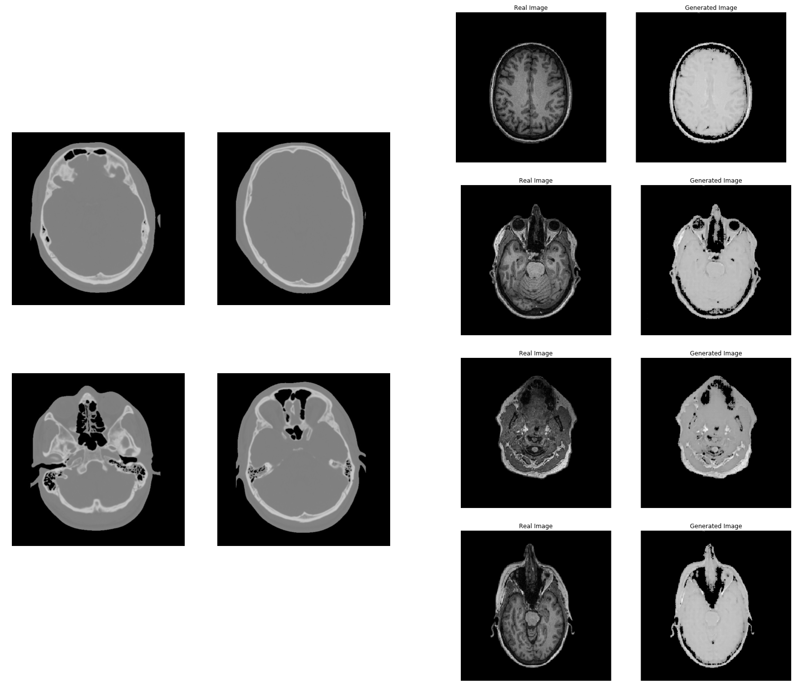
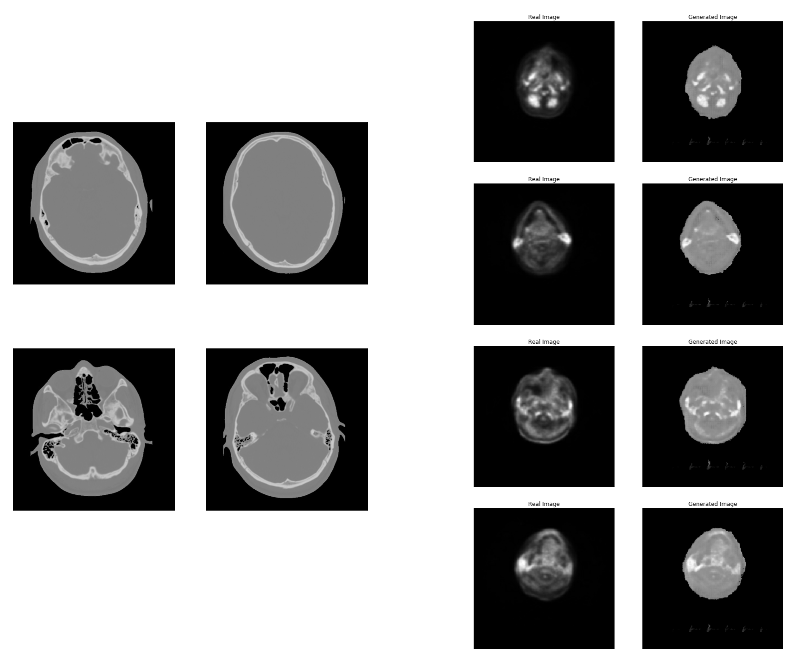

# MedCycleGAN

En este trabajo se presenta una **Generative Adversarial Network** (GAN) para transformar imágenes medicas de tipo MR y PET a imágenes CT. La principal ventaja es reducir los costes, el tiempo y la experiencia del paciente. Muchas veces es necesario sacar distintos tipos de tomografías para evaluar diferentes detalles del paciente, por ejemplo las imágenes MR se usan para detectar tumores en distintos órganos y las tomografías computarizadas se utilizan para planear la dosis en el tratamiento. 

Puedes descargar el notebook con todo el código en TensorFlow 2.0 en este repositorio o visualizarlo [aquí](https://nbviewer.jupyter.org/github/vincent1bt/MedCycleGAN/blob/master/MedCycleGAN.ipynb)

### Imágenes CT
Una tomografía computarizada (TC) es una imagen medica que combina una serie de radiografías que se toman desde diferentes ángulos. De estas imágenes podemos obtener información sobre los huesos, vasos sanguíneos y tejidos blancos. Se pueden utilizar para planificar tratamientos medicos, diagnosticar tumores óseos y fracturas o diagnosticar trastornos musculares y óseos.

Estas imágenes las descargue desde la pagina [qure.ai](http://headctstudy.qure.ai/) ya que ofrece una gran cantidad de imágenes CT del cerebro.

Los imagines originales estaban en el formato **DICOM** usado para imágenes medicas, estas imágenes suelen contener información sobre el paciente y sobre el equipo que se uso para obtener las tomografías.

Para abrir este tipo de imágenes podemos usar una librería en python llamada [pydicom](https://pydicom.github.io/pydicom/stable/index.html), en el folder scripts esta el *script* en python que use para abrir estas imágenes y pasarlas a jpg. Estas imágenes son imágenes 3d en una escala de grises, en este caso el tamaño de cada imagen era de **512x512x233**, donde **233** es la profundidad de la imagen.

De una imagen 3d del cerebro se pueden sacar multiples imágenes 2d dependiendo del ángulo que se requiera:

> Imagen de [https://www.researchgate.net/figure/Brain-MRI-obtained-from-a-Sagittal-Plane-b-Axial-plane-and-c-Coronal-plane_fig1_304891093](https://www.researchgate.net/figure/Brain-MRI-obtained-from-a-Sagittal-Plane-b-Axial-plane-and-c-Coronal-plane_fig1_304891093)

En este ejemplo la imagen **A** es de un plano **sagital**, la imagen **B** es de un plano **transversal** o **axial** y la imagen **C** es de un un plano **coronal**. Pydicom carga estas imágenes como arrays de **numpy**, para obtener las imágenes 2d o *slices* solo tenemos que recorrer la posición del plano en el array. En este caso utilice el plano **axial** del cual obtuve unas 100 imágenes por cada imagen 3d y aunque el numero de imágenes era de **233** no todas son útiles.

> Ejemplo de las imágenes donde se puede apreciar la estructura ósea

Un punto importante a mencionar es que normalice estas imágenes a un rango [0-255] ya que originalmente los rangos llegaban de 0 a 4000, por lo cual se perdió información de estas imágenes.

### Imágenes MR
Las imágenes por resonancia magnética (RM) son imágenes medicas que se pueden obtener sin el uso de radiación dañina. Estas imágenes son útiles para obtener información de las partes no óseas o de los tejidos blancos. Partes como los músculos, la medula espinal y el cerebro se muestran mas claros que en las imágenes CT. Esta es la modalidad de imágenes preferida ya que, a diferencia de las imágenes CT, no utilizan rayos X u otra radiación para escanear el area de interés.

Las imagenes MR las obtuve del dataset [OASIS-3](https://www.oasis-brains.org/). Para descargarlas se require un registro.

A diferencia de las imágenes CT, las imágenes del dataset OASIS-3 vienen en un formato llamado **NIfTI** que muchas veces es mucho mas fácil de usar que el formato DICOM. Python también ofrece una librería para abrir este tipo de imágenes llamada [nibabel](https://nipy.org/nibabel/), el *script* que use para abrir estas imágenes esta disponible en el folder scripts.

> Ejemplo de las imágenes MR.

El proceso para obtener las imágenes fue muy similar al proceso que utilice en las imágenes CT, el principal inconveniente fue que las imágenes tenían un tamaño de **256x170** que no era simétrico, por lo cual tuve que agregar pixeles negros al rededor para obtener una imagen de tamaño **256x256**. Estas imágenes también fueron normalizadas a un rango de [0-255]. Otro de los problemas fue que las imágenes presentaban ruido alrededor del area del cerebro y esto afectaba al entrenamiento, manualmente quite este ruido en cada imagen 2d eliminando la zona de alrededor del cerebro y guardando la imagen en formato png sin transparencia.

### Imágenes PET
La tomografía por emisión de positrones (PET), utiliza pequeñas cantidades de materiales radioactivos denominados radiosondas o radiofármacos. PET puede detectar las manifestaciones tempranas de otras enfermedades.

El proceso para obtener las imágenes 2d fue similar al de las imágenes MR ya que ambas son del mismo dataset **OASIS-3** y ambas están en el formato **NIfTI**. La principal diferencia fue que las imágenes PET tienen transparencia y por esto tuve que sumar 11 imágenes (cada imagen tenia 11 niveles de transparencia) para obtener la imagen final en 2d, todo este proceso se encuentra en el *script* llamado **pet_script**. Por ultimo las imágenes también fueron normalizadas a un rango de [0-255] perdiendo información en el proceso

## Arquitectura
Este trabajo esta basado en los papers [MedGAN: Medical Image Translation using GANs](https://arxiv.org/abs/1806.06397) y [Deep MR to CT Synthesis using Unpaired Data](https://arxiv.org/abs/1708.01155), en el paper **MedGAN: Medical Image Translation using GANs** proponen una nueva arquitectura que pueda ser usada en diferentes tareas como transformar una imagen MR a CT, PET a CT o remover ruido de imágenes MR y PET y que al mismo tiempo otorgue buenos resultados. El 'problema' con esta arquitectura es que requiere de imágenes emparejadas donde el cerebro tiene que estar en la misma posición en ambas imágenes aumentando la complejidad y el tiempo de conseguir el dataset y emparejar las imágenes. En el segundo paper **Deep MR to CT Synthesis using Unpaired Data** se utilizo una arquitectura **CycleGAN** para transformar imágenes MR de un plano sagital a imágenes CT del mismo plano sagital. 

Inspirado por estos dos papers la idea principal del modelo **MedCycleGAN** es obtener el gran resultado que una **MedGAN** puede otorgar y combinarlo con la versatilidad que una CycleGan posee. El modelo generador de la arquitectura MedGan usa 6 **U-nets** (donde el output de una U-net es el input de la siguiente U-net) al cual le llamaron **CasNet**, el modelo discriminador es bastante sencillo ya que solo cuenta con tres capas convolucionales.

Por falta de tiempo y recursos el modelo generador entrenado en este trabajo solo utilizo 3 **U-nets**, el modelo discriminador se mantuvo igual y se uso el mismo flujo que en una **CycleGAN**, dos generadores para transformar imágenes del dominio *x* al dominio *y* y del dominio *y* al dominio *x* y dos discriminadores para verificar que imágenes del dominio *x* y *y* eran reales.

Para entrenar a los modelos se utilizaron 1595 imágenes para cada tipo de imagen.

## Resultados

Lamentablemente los resultados no fueron los esperados por diversas razones, el modelo generador tiene la mitad de parámetros que el original, la arquitectura original usa una función de perdida donde se tiene en cuenta el **contenido** y el **estilo** de una imagen justo como en **style transfer**, esta función de perdida llamada **perceptual loss** require un modelo **VGG-19** entrenado para obtener el estilo y contenido de una imagen lo que alarga el entrenamiento de los modelos

La calidad de las imagenes obtenidas no fue la mejor, los modelos de las arquitecturas originales fueron entrenados en su mayoría con datasets privados y contaron con la ayuda de medicos para seleccionar las mejores, otro punto relacionado fue que mantuvieron los rangos de las imágenes y probablemente después normalizaron estas imágenes a un rango [-1, 1] como se aconseja en estas arquitecturas

El entrenamiento de sus modelos tomo 36 horas en una Titan-X, en este trabajo los modelos MR a CT tomaron 25 horas en la GPU que ofrece Google Colab guardando los chechpoints para volver a restaurar los modelos después de cada desconexión, en el caso de los modelos PET a CT fueron entrenados solo por 15 horas.

## Ejemplos

#### MR a CT

> Las imágenes de la izquierda son imágenes reales del dataset **qure.ai**, la primera fila de las imágenes de la derecha son imágenes MR del dataset **OASIS-3** y la ultima fila son las imágenes generadas.

En las imágenes de arriba podemos notar los resultados del modelo para generar imágenes CT a partir de imágenes MR, aunque las imágenes empezaban a tomar forma  y color, la parte mas importante que es la estructura ósea todavía necesita mejorar.

#### PET a CT

En este caso el segundo modelo generativo que transformaba imágenes PET a imágenes CT tomo forma y color rápidamente ya que este modelo solo estuvo en entrenamiento 15 horas, sin embargo aun falta por desarrollar la estructura ósea y como se puede notar en las imágenes generadas se empezaba a notar ruido en la imagen, probablemente se tengan que limpiar mas las imágenes PET.